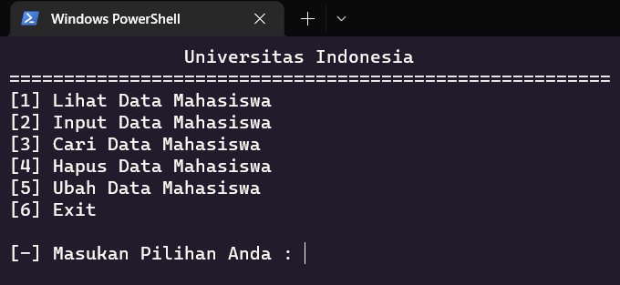
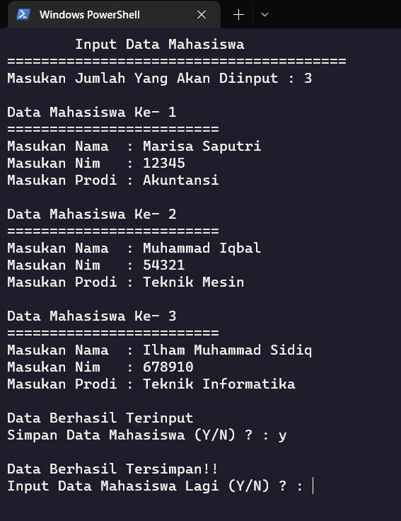
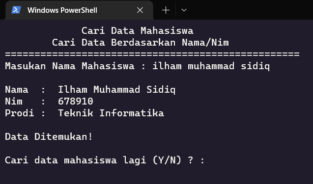
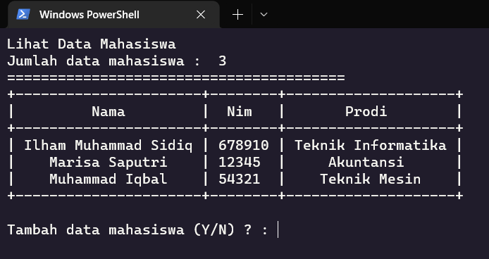
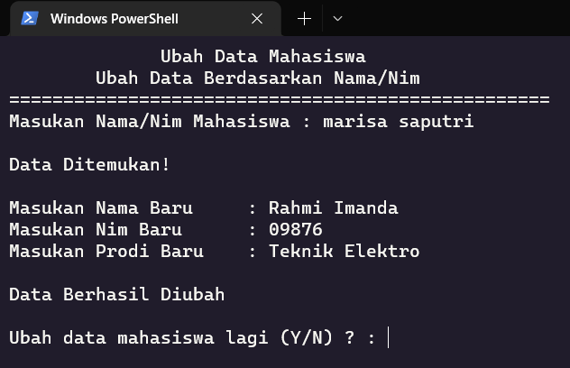
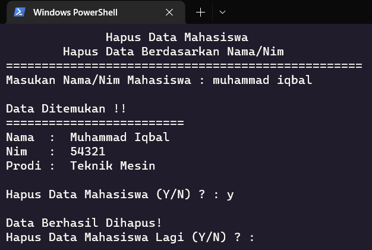

# Apps Crud Universitas Indonesia (CLI)

Ini adalah aplikasi crud Universitas indonesia yang berbasiskan cli dan aplikasi ini belum terintegrasi dengan database, didalam aplikasi ini kita bisa melakukan seperti input data, read data, ubah data, dan delete data.

# Requirement

install prettytable : `python -m pip install -U prettytable`

# Preview

### Menu :

### Input :

### Search :

### Show All Data Mahasiswa :

### Change :

### Delete :

# Sertifikat

- [Dasar AWS Cloud](https://drive.google.com/file/d/1hp_CFxzI9hha7v0BcFmrXjLZKbf_vqWL/view?usp=sharing)
- [Dasar Pemrograman Web](https://drive.google.com/file/d/11vfFGYmBmJpfKMkCghiZuJUfS_ShGzbQ/view?usp=sharing)
- [Membuat Front-End Web untuk Pemula](https://drive.google.com/file/d/1KLi6uk79f2qW6hKHfu-ygyUXIoZr0mGv/view?usp=sharing)
- [HTML & CSS](https://drive.google.com/file/d/1FYmWwKzfOgsPLoXL2MladtgsnbyfA3dl/view?usp=sharing)
- [SQL](https://drive.google.com/file/d/11qQF21pusbxhm2d50RHfbzkYNJbMyGJH/view?usp=sharing)
- [Git](https://drive.google.com/file/d/1QmuRcHq7jX2TPqFa6qQg5OI_3N4wHeA4/view?usp=sharing)
- [Command Line](https://drive.google.com/file/d/1WAN9BxG1OoFVsKan1ztLNIDxnEms-Bi7/view?usp=sharing)
- [Path Pengembangan Web](https://drive.google.com/file/d/1ey2LaKGAxqdvOfvwoV3wqDBXRSGrYP9T/view?usp=sharing)
